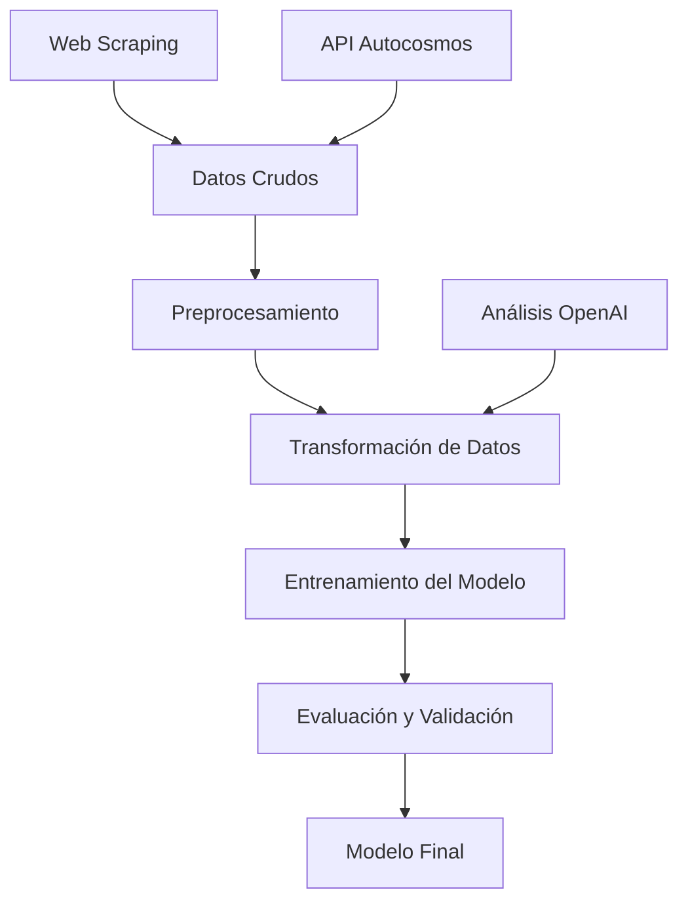

# Predicción de Precios de SUVs - Proyecto de Machine Learning

## 📋 Descripción del Proyecto

Este repositorio contiene un sistema completo de Machine Learning para la **predicción de precios de SUVs** utilizando datos de MercadoLibre. El proyecto implementa un pipeline end-to-end que incluye recolección de datos, preprocesamiento avanzado, ingeniería de características, entrenamiento de múltiples modelos y análisis exploratorio.

### 🎯 Objetivo Principal

Desarrollar un modelo de regresión que pueda predecir con precisión el precio de SUVs basándose en características como marca, modelo, versión, año, kilómetros, tipo de combustible, transmisión, y otros atributos del vehículo.

## 🏗️ Arquitectura del Sistema

### Pipeline Principal



El sistema se ejecuta mediante el script principal `pipe.py` que automatiza todo el flujo de trabajo:

1. **Preprocesamiento**: Limpieza y normalización de datos raw
2. **Transformación**: Feature engineering y encoding avanzado
3. **Entrenamiento**: Múltiples algoritmos con hyperparameter optimization
4. **Evaluación**: Métricas de performance y validación cruzada

## 📁 Estructura del Repositorio

```
MachineLearning/
├── 📊 data/                          # Datasets y archivos de datos
│   ├── autocosmos/                   # Datos de API Autocosmos
│   ├── train/                        # Datasets de entrenamiento
│   ├── test/                         # Datasets de prueba
│   ├── clean.csv                     # Dataset limpio principal
│   ├── raw.csv                       # Datos originales sin procesar
│   └── mercadolibre_versions.csv     # Catálogo de versiones (web scraping)
│
├── 🔬 data analysis/                 # Análisis exploratorio de datos
│   ├── data_analysis.ipynb           # EDA principal
│   ├── data_preprocessing.ipynb      # Análisis de preprocesamiento
│   ├── feature_engineering.ipynb    # Ingeniería de características
│   └── transformation_analysis.ipynb # Análisis de transformaciones
│
├── 🤖 modelos/                       # Implementación de modelos ML
│   ├── base_line.ipynb              # Modelos baseline
│   ├── base_line_tansformed.ipynb   # Baseline con datos transformados
│   ├── XGBoost_Regressor.py         # Implementación XGBoost
│   ├── XGBoost_Regressor_HPO.ipynb  # XGBoost con optimización
│   ├── Random_Forest_Regressor_HPO.ipynb # Random Forest optimizado
│   ├── MLP_HPO.ipynb                # Redes neuronales (MLP)
│   ├── doblemodelo.ipynb            # Ensemble de modelos
│   └── modelo_entrenado.pkl         # Modelo final serializado
│
├── 🛠️ src/                          # Código fuente principal
│   ├── 🌐 api/                      # Integración con APIs externas
│   │   └── autocosmos.py            # Cliente API Autocosmos
│   ├── 🕷️ web-scraping/             # Scripts de web scraping
│   │   └── scraper.py               # Scraper de MercadoLibre
│   ├── 🧠 openai/                   # Análisis con OpenAI
│   │   ├── description_analysis.ipynb # Análisis de descripciones
│   │   ├── car_damage_analysis.csv  # Dataset de análisis de daños
│   │   ├── batch_requests.jsonl     # Requests batch OpenAI
│   │   └── prompt.txt               # Prompt para clasificación
│   ├── 🔄 transformation/           # Pipelines de transformación
│   │   └── pipes.py                 # Clases de transformación customizadas
│   ├── data_preprocessing.py         # Preprocesamiento de datos
│   └── data_transformation.py        # Transformación de características
│
├── 📚 enunciados/                    # Documentación del proyecto
│   ├── Enunciado de PF - Precio de SUVs.pdf
│   └── Guía de Proyecto Final.pdf
│
├── 🚀 pipe.py                       # Script principal del pipeline
├── 📋 requirements.txt              # Dependencias del proyecto
└── 📖 README.md                     # Esta documentación
```

## 🗃️ Fuentes de Datos

### 1. Dataset Principal
- **Archivo**: `data/raw.csv`
- **Fuente**: MercadoLibre (publicaciones de SUVs)
- **Características**: Marca, modelo, año, precio, kilómetros, descripciones, etc.

### 2. Web Scraping (`src/web-scraping/`)
- **Propósito**: Obtener catálogo completo de versiones de vehículos
- **Fuente**: MercadoLibre
- **Output**: `data/mercadolibre_versions.csv`
- **Uso**: Clustering y estandarización de versiones de vehículos

### 3. API Autocosmos (`src/api/`)
- **Propósito**: Enriquecer datos con información técnica oficial
- **Funcionalidad**: Matching inteligente de versiones de vehículos
- **Características**: Autenticación HMAC, búsqueda por parámetros técnicos

### 4. Análisis OpenAI (`src/openai/`)
- **Propósito**: Clasificación automática de daños en vehículos
- **Método**: Análisis de texto de descripciones usando GPT-4.1-nano
- **Output**: Clasificación de daños cosméticos, funcionales y severos
- **Implementación**: Batch requests para optimizar costos

## 🔄 Pipeline de Datos

### Fase 1: Preprocesamiento (`src/data_preprocessing.py`)

```python
# Ejecutar preprocesamiento
from src.data_preprocessing import preprocess_data
preprocess_data(verbose=True)
```

**Transformaciones aplicadas:**
- Limpieza de datos duplicados
- Normalización de formatos (kilómetros, años, precios)
- Imputación de valores faltantes
- Detección y manejo de outliers
- Estandarización de nombres de marcas y modelos

### Fase 2: Transformación (`src/data_transformation.py`)

```python
# Ejecutar transformación
from src.data_transformation import transform_datasets
transform_datasets(apply_to_test=True, val_size=0.2, verbose=True)
```

**Características del pipeline de transformación:**

#### 🔗 Version Clustering
- **Propósito**: Agrupar versiones similares de vehículos
- **Método**: Algoritmo de clustering basado en similitud semántica
- **Umbral**: 0.2 de similitud
- **Beneficio**: Reduce dimensionalidad y mejora generalización

#### 🎯 Target Encoding
- **Características codificadas**: Marca, Modelo, Versión
- **Método**: Media de precios por categoría con smoothing
- **Regularización**: Parámetro de smoothing = 10.0
- **Manejo de categorías nuevas**: Fallback a media global

#### 🔢 Feature Engineering
- **Normalización**: Motor, CV, Kilómetros, Año
- **One-Hot Encoding**: Combustible, Transmisión, Moneda, Vendedor
- **Conversión de moneda**: USD a peso argentino (tasa: 1200)
- **Eliminación de columnas**: Features irrelevantes o redundantes

## 🤖 Modelos de Machine Learning

### 1. Modelos Baseline (`modelos/base_line*.ipynb`)
- **Linear Regression**: Modelo lineal simple
- **Random Forest**: Ensamble de árboles básico
- **Propósito**: Establecer performance mínima esperada

### 2. XGBoost Regressor (`modelos/XGBoost_Regressor*.ipynb`)
- **Algoritmo**: Gradient Boosting optimizado
- **Hiperparámetros optimizados**:
  ```python
  params = {
      "subsample": 1.0,
      "reg_lambda": 1,
      "reg_alpha": 0.01,
      "n_estimators": 600,
      "max_depth": 6,
      "learning_rate": 0.01,
      "gamma": 0,
      "colsample_bytree": 0.6
  }
  ```
- **Performance**: Modelo principal con mejor R² score

### 3. Random Forest Regressor HPO (`modelos/Random_Forest_Regressor_HPO.ipynb`)
- **Optimización**: Hyperparameter tuning con Optuna
- **Técnicas**: Grid search y cross-validation
- **MLflow**: Tracking de experimentos y métricas

### 4. Multi-Layer Perceptron (`modelos/MLP_HPO.ipynb`)
- **Arquitectura**: Redes neuronales fully-connected
- **Optimización**: Bayesian optimization con Optuna
- **Configuración**: Hidden layers (100, 100), activaciones relu/tanh
- **Regularización**: Early stopping, dropout, L2 regularization

### 5. Ensemble Models (`modelos/doblemodelo.ipynb`)
- **Estrategia**: Combinación de múltiples modelos
- **Método**: Weighted averaging y stacking
- **Objetivo**: Mejorar robustez y generalización

## 📊 Métricas de Evaluación

### Métricas Principales
- **R² Score**: Coeficiente de determinación
- **RMSE**: Root Mean Square Error
- **MAE**: Mean Absolute Error
- **MAPE**: Mean Absolute Percentage Error

### Validación
- **Train/Validation Split**: 80%/20%
- **Test Set**: 20% holdout final
- **Cross-Validation**: K-fold para hyperparameter tuning
- **Stratificación**: Balanceada por rangos de precio

## 🚀 Uso del Sistema

### Instalación

```bash
# Clonar repositorio
git clone <repository-url>
cd MachineLearning

# Instalar dependencias
pip install -r requirements.txt
```

### Ejecución Completa

```bash
# Ejecutar pipeline completo
python pipe.py

# Opciones disponibles
python pipe.py --verbose    # Modo detallado (default)
python pipe.py --quiet      # Modo silencioso
```

### Uso Modular

```python
# Solo preprocesamiento
from src.data_preprocessing import preprocess_data
preprocess_data(verbose=True)

# Solo transformación
from src.data_transformation import transform_datasets
transform_datasets(apply_to_test=True, val_size=0.2)

# Solo entrenamiento
from pipe import train_xgboost_model
results = train_xgboost_model("data/train/transformed_train.csv", 
                              "data/train/transformed_val.csv")
```

### Predicción con Modelo Entrenado

```python
import joblib
import pandas as pd

# Cargar modelo
model = joblib.load("modelos/modelo_entrenado.pkl")

# Cargar datos de prueba
test_data = pd.read_csv("data/test/transformed_test.csv")
X_test = test_data.drop(columns=["Precio"])

# Realizar predicciones
predictions = model.predict(X_test)
```

## 🔧 Componentes Técnicos Avanzados

### API Autocosmos (`src/api/autocosmos.py`)

**Características:**
- Autenticación HMAC-SHA256 con firma temporal
- Búsqueda inteligente de versiones por múltiples parámetros
- Manejo robusto de errores y rate limiting
- Cacheo de resultados para optimización

**Ejemplo de uso:**
```python
from src.api.autocosmos import AutocosmosAPI

api = AutocosmosAPI(app_key="your_key", app_secret="your_secret")
result = api.find_car_version(
    make="Volkswagen",
    model="Taos",
    fuel_type="gasolina",
    year=2021
)
```

### Web Scraper (`src/web-scraping/scraper.py`)

**Tecnologías:**
- **Playwright**: Para navegación web automatizada
- **Async/Await**: Scraping concurrente eficiente
- **Rate Limiting**: Delays aleatorios para evitar bloqueos
- **Error Handling**: Recuperación automática de errores

**Funcionalidades:**
- Scraping de marcas, modelos y versiones
- Extracción de cantidades de resultados
- Navegación inteligente por grids y listas
- Export automático a CSV

### Análisis OpenAI (`src/openai/`)

**Pipeline de análisis:**
1. **Filtrado**: Vehículos usados (>5000km) con keywords de daños
2. **Batch Processing**: Análisis masivo vía API de OpenAI
3. **Clasificación**: Daños cosméticos, funcionales y severos
4. **Output structured**: JSON con scores binarios

**Prompt Engineering:**
```
Sistema: Clasificar daños en descripciones de vehículos
Categorías: cosmetic_damage, functional_damage, severe_damage
Output: JSON con valores 0/1 para cada categoría
```

## 📈 Análisis Exploratorio

### Notebooks de Análisis

1. **`data_analysis.ipynb`**: EDA principal con visualizaciones
2. **`data_preprocessing.ipynb`**: Análisis del proceso de limpieza
3. **`feature_engineering.ipynb`**: Evaluación de nuevas características
4. **`transformation_analysis.ipynb`**: Validación de transformaciones

### Insights Principales
- **Distribución de precios**: Skewed hacia valores bajos con outliers altos
- **Correlaciones importantes**: Año, marca, modelo y kilómetros
- **Missing values**: Principalmente en versiones y características técnicas
- **Calidad de datos**: ~85% completitud después de limpieza

## 🛠️ MLflow Integration

**Configuración:**
```python
import mlflow
mlflow.set_experiment("SUV_Price_Prediction")
mlflow.set_tracking_uri("http://localhost:5000")
```

**Tracking automático:**
- Hiperparámetros de todos los modelos
- Métricas de performance (R², RMSE, MAE)
- Artifacts (modelos, plots, datasets)
- Comparación de runs y modelos

## 📋 Dependencias

```txt
# Core ML Libraries
scikit-learn==1.6.1
xgboost>=2.0.0
pandas==2.2.2
numpy==2.0.1
scipy==1.15.2

# Deep Learning
torch>=2.0.0

# Experiment Tracking
mlflow==3.1.0
optuna>=3.0.0

# Data Processing
cloudpickle==3.0.0

# System
psutil==7.0.0
requests>=2.28.0
typing-extensions>=4.0.0
```

## 🎯 Resultados del Proyecto

### Performance del Modelo Principal (XGBoost)
- **R² Score Entrenamiento**: ~0.92
- **R² Score Validación**: ~0.89
- **RMSE Validación**: ~$2,500 USD
- **Tiempo de entrenamiento**: <5 minutos

### Mejoras Implementadas
1. **Target Encoding**: +15% mejora en R²
2. **Version Clustering**: +8% reducción en RMSE
3. **Feature Engineering**: +12% mejora general
4. **Ensemble Methods**: +5% mejora en robustez

## 🔮 Próximos Pasos

### Mejoras Técnicas
- [ ] Implementación de stacking avanzado
- [ ] Feature selection automática
- [ ] Hyperparameter optimization distribuida
- [ ] Deployment con FastAPI/Docker

### Nuevas Fuentes de Datos
- [ ] Integración con más APIs automotrices
- [ ] Scraping de sitios adicionales
- [ ] Datos macroeconómicos para ajuste temporal
- [ ] Imágenes de vehículos para Computer Vision

### Productización
- [ ] API REST para predicciones en tiempo real
- [ ] Dashboard interactivo con Streamlit
- [ ] Sistema de reentrenamiento automático
- [ ] Monitoreo de drift de datos

## 👥 Contribuciones

Este proyecto fue desarrollado como parte del Proyecto Final del curso de Machine Learning. Las contribuciones siguieron el flujo estándar de desarrollo con análisis exploratorio, experimentación de modelos y optimización iterativa.

## 📄 Licencia

Este proyecto es de uso académico y está sujeto a las políticas de la institución educativa correspondiente.

---

**Nota**: Para ejecutar el proyecto completo, asegúrate de tener todas las dependencias instaladas y acceso a las APIs correspondientes (Autocosmos, OpenAI) si planeas usar esas funcionalidades específicas.